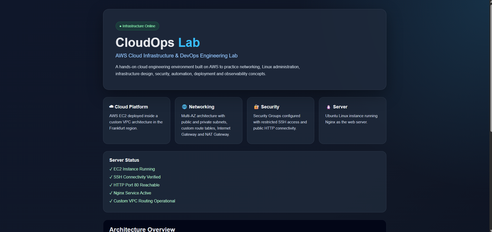
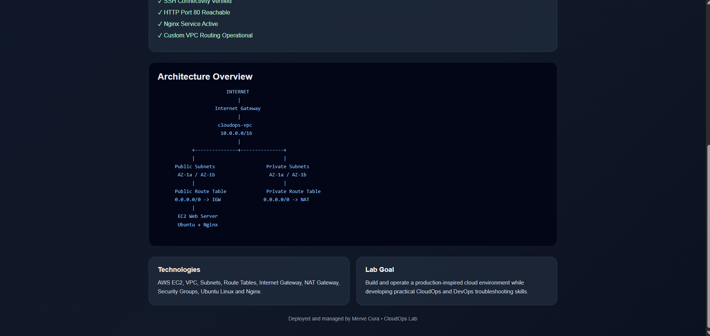

# ☁️ CloudOps Lab

A hands-on Cloud and DevOps engineering lab focused on building, operating, troubleshooting, and automating cloud infrastructure.

This repository documents my practical learning journey across AWS, Linux administration, networking, web servers, containers, CI/CD, Infrastructure as Code, Kubernetes, and monitoring.

---

## 🚀 Day 1 — AWS EC2, Linux & Nginx

### Objective

Provision and configure a Linux-based web server on AWS, establish secure remote access, perform basic Linux administration, troubleshoot network connectivity, and deploy a custom static website using Nginx.

---

## 🏗️ Architecture

```text
                    Internet
                       │
                       │ HTTP :80
                       ▼
               ┌─────────────────┐
               │ Security Group  │
               │                 │
               │ SSH  :22        │
               │ HTTP :80        │
               └────────┬────────┘
                        │
                        ▼
               ┌─────────────────┐
               │    AWS EC2      │
               │  Ubuntu Linux   │
               │                 │
               │     Nginx       │
               │       │         │
               │       ▼         │
               │ /var/www/html   │
               │   index.html    │
               └─────────────────┘
```

---

## 🛠️ Technologies Used

- AWS EC2
- AWS Security Groups
- Ubuntu Linux
- SSH
- Nginx
- HTTP
- Linux CLI
- GitHub Issues
- GitHub Projects

---

## ☁️ AWS EC2 Provisioning

A development EC2 instance was provisioned in the AWS Frankfurt region (`eu-central-1`) using Ubuntu Linux.

The instance was configured as a small development server for practicing Linux administration and CloudOps operations.

During provisioning, I worked with:

- EC2 instances
- AMIs
- Instance types
- EBS storage
- Public and private IPv4 addresses
- Security Groups
- SSH key-based authentication
- Instance start/stop lifecycle

---

## 🔐 SSH Access

Remote administration of the server was performed using SSH with public-key authentication.

Example:

```bash
ssh -i cloudops-dev-key.pem ubuntu@<PUBLIC_IP>
```

SSH access was restricted using the EC2 Security Group rather than unnecessarily exposing port `22` to the entire internet.

Because the instance does not currently use an Elastic IP, its public IPv4 address may change after a stop/start cycle.

---

## 🐧 Linux Server Administration

After connecting to the instance, basic system and resource checks were performed.

### User and system identity

```bash
whoami
hostname
pwd
```

### Network interfaces

```bash
ip addr
```

### Memory usage

```bash
free -h
```

### Filesystem usage

```bash
df -h
```

### Directory disk usage

```bash
sudo du -sh /var/*
```

### Running processes

```bash
ps aux
ps aux | grep ssh
```

These commands were used to inspect the operating system, network configuration, memory, storage, directories, and running processes.

---

## 🌐 Nginx Web Server

Nginx was installed as the HTTP web server.

```bash
sudo apt update
sudo apt install nginx
```

The service status was verified with:

```bash
systemctl status nginx
```

Running Nginx processes were inspected with:

```bash
ps aux | grep nginx
```

Port `80` was verified as listening with:

```bash
ss -tulpn | grep :80
```

The web server was then tested locally:

```bash
curl http://localhost
```

This confirmed that Nginx was running and responding to HTTP requests from inside the EC2 instance.

---

## 🔎 HTTP Connectivity Troubleshooting

During the lab, Nginx worked correctly through `localhost`, but the website was initially not reachable from an external browser.

The investigation included checking:

1. Nginx service status
2. Nginx processes
3. Listening ports
4. Local HTTP connectivity
5. AWS Security Group inbound rules

Since:

```bash
curl http://localhost
```

returned the Nginx page and port `80` was listening, the application itself was working correctly.

The issue was identified at the AWS network access layer: the Security Group initially allowed SSH traffic but did not allow inbound HTTP traffic.

An inbound HTTP rule for TCP port `80` was added.

After updating the Security Group, the Nginx server became reachable through the EC2 public IPv4 address.

### Root Cause

Missing inbound HTTP (`TCP/80`) rule in the EC2 Security Group.

### Resolution

Allow inbound HTTP traffic on port `80` through the required Security Group rule.

---

## 💻 Custom Website Deployment

Instead of keeping the default Nginx welcome page, a custom CloudOps Lab page was deployed.

The default Nginx web directory was inspected:

```bash
cd /var/www/html
ls -la
```

The original Nginx page was backed up before making changes:

```bash
sudo cp index.nginx-debian.html index.nginx-debian.html.backup
```

A custom page was then created:

```bash
sudo nano index.html
```

The deployed page contains information about the lab environment and verifies that the EC2 + Nginx deployment is operational.

The final deployment path is:

```text
/var/www/html/index.html
```

Local verification:

```bash
curl http://localhost
```

External verification was performed by accessing the EC2 public IPv4 address from a browser.

---

## 📸 Deployment Result

The custom CloudOps Lab page is successfully served by Nginx from the AWS EC2 instance.


---

## 📁 File Transfer with SCP

The deployed website source was transferred securely from the remote EC2 instance to the local Windows machine using SCP.

Example:

```bash
scp -i cloudops-dev-key.pem ubuntu@<PUBLIC_IP>:/var/www/html/index.html <LOCAL_PATH>
```

This allowed the deployed source code to be stored and versioned in this GitHub repository.

> Private key files such as `.pem` files must never be committed to the repository.

---

## 🧠 Key Learnings

This lab provided hands-on practice with:

- Provisioning an AWS EC2 instance
- Connecting securely to Linux servers using SSH
- Understanding public and private IP addresses
- Working with AWS Security Groups
- Inspecting Linux system resources
- Managing and inspecting Linux processes
- Installing and operating Nginx
- Understanding listening ports
- Testing HTTP services using `curl`
- Troubleshooting connectivity across application and network layers
- Understanding the Nginx web root
- Working with Linux file permissions
- Deploying custom static web content
- Transferring files between remote and local systems using SCP
- Documenting engineering work with GitHub Issues and Projects

---

## 🧩 Troubleshooting Approach

One of the main lessons from this lab was to troubleshoot connectivity layer by layer rather than changing configurations randomly.

```text
Browser
   ↓
Public IP
   ↓
AWS Security Group
   ↓
TCP Port 80
   ↓
Nginx
   ↓
/var/www/html/index.html
```

Testing each layer individually makes it easier to isolate the root cause of infrastructure problems.

---

## 📌 Project Progress

### Day 1 — Completed ✅

- [x] Provision AWS EC2 instance
- [x] Configure secure SSH access
- [x] Inspect Linux system resources
- [x] Inspect networking and processes
- [x] Install Nginx
- [x] Verify Nginx service
- [x] Verify listening HTTP port
- [x] Test HTTP locally with `curl`
- [x] Configure HTTP access through Security Group
- [x] Troubleshoot external connectivity
- [x] Deploy custom static website
- [x] Transfer deployed source using SCP
- [x] Document work using GitHub Issues and Projects

### Next

**Day 2 — AWS Networking & IAM**

---

# 🌐 Day 2 — AWS Networking & IAM

## Objective

Understand and validate the networking architecture used by the AWS EC2 development server and learn the fundamentals of AWS Identity and Access Management (IAM).

---

## 🌍 VPC Architecture

The EC2 instance is currently deployed inside the AWS default VPC in the Frankfurt region (`eu-central-1`).

```text
Internet
    │
    ▼
Internet Gateway
    │
    ▼
┌───────────────────────────────────────┐
│ VPC: 172.31.0.0/16                   │
│                                       │
│ Route Table                           │
│ ├── 172.31.0.0/16 → local            │
│ └── 0.0.0.0/0 → Internet Gateway     │
│                                       │
│ ┌───────────────────────────────────┐ │
│ │ Public Subnet                    │ │
│ │ 172.31.32.0/20                   │ │
│ │ Availability Zone: eu-central-1b │ │
│ │                                   │ │
│ │ Network ACL                       │ │
│ │        ↓                          │ │
│ │ Security Group                    │ │
│ │        ↓                          │ │
│ │ EC2 Instance                      │ │
│ │ Private IP: 172.31.35.155         │ │
│ └───────────────────────────────────┘ │
│                                       │
└───────────────────────────────────────┘
```

The Internet Gateway is attached to the VPC and provides a path between the VPC and the internet.

---

## 🧩 VPC and CIDR

The VPC uses the following IPv4 CIDR block:

```text
172.31.0.0/16
```

The `/16` prefix defines the network portion of the address range.

The EC2 instance is deployed in the subnet:

```text
172.31.32.0/20
```

This subnet is a smaller address range within the VPC.

The EC2 private IPv4 address:

```text
172.31.35.155
```

belongs to both the VPC address range and the subnet address range.

---

## 🏢 Availability Zones and Subnets

The default VPC contains multiple subnets distributed across Availability Zones.

The Network ACL inspected during the lab was associated with three subnets:

```text
eu-central-1a → 172.31.16.0/20
eu-central-1b → 172.31.32.0/20
eu-central-1c → 172.31.0.0/20
```

The development EC2 instance is located in:

```text
eu-central-1b
└── 172.31.32.0/20
    └── EC2: 172.31.35.155
```

A VPC is regional, while each subnet belongs to a single Availability Zone.

---

## 🛣️ Route Table

The subnet's route table contained two important routes:

```text
Destination       Target

172.31.0.0/16  →  local
0.0.0.0/0      →  Internet Gateway
```

### Local Route

```text
172.31.0.0/16 → local
```

Traffic destined for resources inside the VPC can remain within the VPC network.

### Default Internet Route

```text
0.0.0.0/0 → Internet Gateway
```

IPv4 traffic that does not match a more specific route can be directed toward the Internet Gateway.

The presence of a default route to an Internet Gateway is a key characteristic of a public subnet.

---

## 🌐 Internet Gateway

An Internet Gateway (IGW) is attached to the VPC and provides connectivity between the VPC and the internet when the required routing and addressing configuration is present.

The relationship inspected during the lab was:

```text
Internet
    ↕
Internet Gateway
    ↕
VPC
    │
    └── Public Subnet
            │
            └── EC2
```

The Internet Gateway alone does not make an EC2 instance publicly reachable.

Public connectivity also depends on components such as:

- Public IPv4 addressing
- Route table configuration
- Security Group rules
- Network ACL rules

---

## 🔐 Security Groups

The EC2 instance uses the Security Group:

```text
cloudops-dev-sg
```

Security Groups operate at the network interface (ENI) level.

### Inbound Rules

The development server was configured to allow:

```text
SSH  TCP/22 → Administrator public IP
HTTP TCP/80 → 0.0.0.0/0
```

SSH access is restricted while the web server is publicly reachable over HTTP.

### Outbound Rules

The Security Group currently allows outbound IPv4 traffic:

```text
All traffic → 0.0.0.0/0
```

This allows the instance to initiate connections to external services when required.

### Stateful Behavior

Security Groups are stateful.

When traffic is allowed in one direction, response traffic belonging to that established connection is automatically allowed.

---

## 🛡️ Network ACL

A Network Access Control List (NACL) provides traffic filtering at the subnet level.

The default NACL associated with the development subnet currently allows IPv4 traffic in both directions.

### Inbound

```text
Rule 100 → 0.0.0.0/0 → ALLOW
Rule *   → Remaining traffic → DENY
```

### Outbound

```text
Rule 100 → 0.0.0.0/0 → ALLOW
Rule *   → Remaining traffic → DENY
```

NACL rules are evaluated starting with the lowest rule number, and processing stops when a matching rule is found.

Unlike Security Groups, NACLs are stateless. Inbound and outbound traffic must therefore be considered separately.

---

## 🔎 Security Group vs Network ACL

| Feature | Security Group | Network ACL |
|---|---|---|
| Scope | ENI / EC2 | Subnet |
| Stateful | Yes | No |
| Allow rules | Yes | Yes |
| Deny rules | No | Yes |
| Rule processing | All applicable rules | Lowest-numbered matching rule first |
| Return traffic | Automatically tracked | Must be handled by rules |

---

## 🌍 Public vs Private Subnets

### Public Subnet

A public subnet has a route to an Internet Gateway.

Example:

```text
0.0.0.0/0 → Internet Gateway
```

The subnet used by the development EC2 instance is public because its route table contains this route.

For an EC2 instance to communicate directly with the internet over IPv4, additional requirements such as appropriate public addressing and security rules must also be satisfied.

### Private Subnet

A private subnet does not have a direct route to an Internet Gateway for internet-bound traffic.

Private subnets are commonly used for resources that should not be directly exposed to the internet, such as:

- Application servers
- Internal services
- Databases

---

## 🔄 NAT Gateway

Resources inside private subnets may still need outbound internet access for operations such as downloading packages or updates.

A common architecture uses a NAT Gateway:

```text
Private EC2
     │
     ▼
Private Subnet Route Table
     │
     ▼
NAT Gateway
(in a Public Subnet)
     │
     ▼
Internet Gateway
     │
     ▼
Internet
```

This allows private resources to initiate outbound IPv4 connections without making them directly reachable through the NAT Gateway from the public internet.

A NAT Gateway was not created during this lab to avoid unnecessary AWS charges.

---

# 🔑 AWS IAM Fundamentals

## IAM Overview

AWS Identity and Access Management (IAM) controls authentication and authorization for AWS resources.

The four fundamental concepts reviewed were:

```text
User
Group
Role
Policy
```

### IAM User

Represents an identity with credentials, commonly used for a person or workload where an IAM user is appropriate.

The lab uses an IAM user named:

```text
cloudops-admin
```

### IAM Group

A collection of IAM users.

Groups make it possible to assign permissions to multiple users through shared policies.

### IAM Role

An IAM Role is an assumable identity that can provide temporary permissions to trusted users, applications, or AWS services.

Example:

```text
EC2
 ↓
IAM Role
 ↓
Policy
 ↓
S3
```

Instead of storing long-lived AWS access keys on an EC2 instance, a role can provide temporary credentials to the workload.

### IAM Policy

A policy defines permissions.

In simple terms:

```text
Role/User → WHO receives permissions?
Policy    → WHAT is allowed or denied?
```

---

## 📜 IAM Policy Structure

Example:

```json
{
  "Version": "2012-10-17",
  "Statement": [
    {
      "Effect": "Allow",
      "Action": "ec2:DescribeInstances",
      "Resource": "*"
    }
  ]
}
```

Important fields:

- `Effect` → Allow or Deny
- `Action` → AWS API operation
- `Resource` → Resource(s) the statement applies to
- `Statement` → One or more permission statements

---

## 🚫 IAM Access Denied Investigation

While exploring IAM, the `cloudops-admin` user received Access Denied responses for operations including:

```text
iam:ListUsers
iam:ListPolicies
```

The error indicated that no identity-based policy attached to the current identity allowed those actions.

This demonstrated an important IAM principle:

> A user being able to manage EC2 or VPC resources does not automatically mean that the user can administer IAM.

The name of an IAM user also does not determine its permissions. Effective permissions are controlled by policies and other applicable authorization controls.

---

## 🔒 Principle of Least Privilege

IAM permissions should follow the Principle of Least Privilege:

> Grant only the permissions required to perform the intended task.

This reduces unnecessary access and limits the potential impact of credential misuse or configuration mistakes.

---

## 🧠 Day 2 Key Learnings

- VPC and subnet relationships
- IPv4 CIDR notation
- Availability Zones
- Public and private IPv4 addressing
- Route tables
- Local routes
- Default routes
- Internet Gateways
- Public and private subnet concepts
- Security Group inbound and outbound rules
- Stateful firewall behavior
- Network ACLs
- Stateless firewall behavior
- Security Group vs NACL
- NAT Gateway architecture
- IAM Users
- IAM Groups
- IAM Roles
- IAM Policies
- IAM Policy JSON structure
- Access Denied troubleshooting
- Principle of Least Privilege

---

## ✅ Day 2 Status

- [x] VPC inspected
- [x] VPC CIDR identified
- [x] Subnet inspected
- [x] Subnet CIDR identified
- [x] Availability Zone reviewed
- [x] Route table inspected
- [x] Internet Gateway identified
- [x] Public/private IP concepts reviewed
- [x] Security Group rules inspected
- [x] Network ACL inspected
- [x] Security Group vs NACL understood
- [x] Public vs private subnet concepts reviewed
- [x] NAT Gateway architecture reviewed
- [x] IAM fundamentals reviewed
- [x] IAM Policy structure reviewed
- [x] Least Privilege principle reviewed
- [x] Networking and IAM concepts documented

### Next

**Day 3 — Custom AWS Network Architecture & Service Integration**

# 🌐 Day 3 — Custom AWS VPC & Multi-AZ Network Architecture

## 🎯 Objective

Build a custom AWS network from scratch instead of relying on the default VPC.

The environment was designed with multiple Availability Zones, public/private subnets, controlled routing, secure EC2 access, NAT-based outbound connectivity, and a public Nginx web server.

---

## 🏗️ Architecture

```text
                                  Internet
                                     │
                                     ▼
                             Internet Gateway
                                     │
                                     ▼
┌──────────────────────────────────────────────────────────────────┐
│                         cloudops-vpc                             │
│                         10.0.0.0/16                              │
│                                                                  │
│          eu-central-1a                     eu-central-1b          │
│                                                                  │
│   ┌─────────────────────┐           ┌─────────────────────┐     │
│   │ Public Subnet 1     │           │ Public Subnet 2     │     │
│   │ 10.0.1.0/24         │           │ 10.0.3.0/24         │     │
│   │                     │           │                     │     │
│   │ Public EC2          │           │                     │     │
│   │ Ubuntu + Nginx      │           │                     │     │
│   │                     │           │                     │     │
│   │ NAT Gateway         │           │                     │     │
│   └──────────┬──────────┘           └─────────────────────┘     │
│              │                                                   │
│   ┌──────────▼──────────┐           ┌─────────────────────┐     │
│   │ Private Subnet 1    │           │ Private Subnet 2    │     │
│   │ 10.0.2.0/24         │           │ 10.0.4.0/24         │     │
│   │                     │           │                     │     │
│   │ Private EC2         │           │                     │     │
│   │ No Public IPv4      │           │                     │     │
│   └─────────────────────┘           └─────────────────────┘     │
│                                                                  │
└──────────────────────────────────────────────────────────────────┘
```

### Environment Summary

```text
1 Custom VPC
2 Availability Zones
4 Subnets
├── 2 Public Subnets
└── 2 Private Subnets

1 Internet Gateway
1 NAT Gateway
1 Elastic IP
2 Route Tables
1 Public EC2
1 Private EC2
2 Dedicated Security Groups
```

---

## 🛠️ AWS Services & Technologies

- AWS VPC
- EC2
- Public & Private Subnets
- Availability Zones
- Route Tables
- Internet Gateway
- NAT Gateway
- Elastic IP
- Security Groups
- Ubuntu Linux
- SSH / ProxyJump
- Nginx
- HTTP
- Linux CLI
- GitHub Issues & Projects

---

## 🌍 Network Design

The custom VPC was created with:

```text
cloudops-vpc
10.0.0.0/16
```

Four `/24` subnets were distributed across two Availability Zones:

| Subnet | CIDR | AZ | Type |
|---|---|---|---|
| `cloudops-public-subnet-1` | `10.0.1.0/24` | eu-central-1a | Public |
| `cloudops-private-subnet-1` | `10.0.2.0/24` | eu-central-1a | Private |
| `cloudops-public-subnet-2` | `10.0.3.0/24` | eu-central-1b | Public |
| `cloudops-private-subnet-2` | `10.0.4.0/24` | eu-central-1b | Private |

This created a Multi-AZ foundation that can later be extended with load balancing, Auto Scaling, databases, and container workloads.

---

## 🛣️ Routing

### Public Route Table

```text
cloudops-public-rt

10.0.0.0/16 → local
0.0.0.0/0   → Internet Gateway
```

Associated with both public subnets.

### Private Route Table

```text
cloudops-private-rt

10.0.0.0/16 → local
0.0.0.0/0   → NAT Gateway
```

Associated with both private subnets.

The resulting traffic paths are:

```text
Public:
EC2 → Public Route Table → Internet Gateway → Internet

Private:
EC2 → Private Route Table → NAT Gateway → Internet Gateway → Internet
```

---

## 🔐 Security Design

### Public EC2 Security Group

```text
cloudops-web-sg
```

Inbound:

```text
SSH   TCP/22 → Administrator public IP
HTTP  TCP/80 → 0.0.0.0/0
```

SSH administration is restricted while HTTP remains publicly accessible.

### Private EC2 Security Group

```text
cloudops-private-sg
```

Inbound SSH is allowed from:

```text
cloudops-web-sg
```

instead of exposing port 22 to the internet.

```text
Local PC
   │
   ▼
Public EC2
cloudops-web-sg
   │
   │ SSH
   ▼
Private EC2
cloudops-private-sg
```

This demonstrated Security Group referencing between application tiers.

---

## 🖥️ Public EC2 & Nginx

A public Ubuntu EC2 instance was launched in:

```text
cloudops-public-subnet-1
```

Nginx was installed and verified:

```bash
sudo apt update
sudo apt install nginx -y
sudo systemctl status nginx
```

The service returned:

```text
Active: active (running)
```

HTTP connectivity through the EC2 public IPv4 address was successfully verified.

---

## 🎨 Custom Web Deployment

A custom CloudOps page was created:

```text
/var/www/html/cloudops.html
```

The Nginx index configuration was updated:

```nginx
index cloudops.html index.html index.htm index.nginx-debian.html;
```

Before applying the change, the configuration was validated:

```bash
sudo nginx -t
```

Then Nginx was reloaded without stopping the service:

```bash
sudo systemctl reload nginx
```

The custom page was successfully served from the public EC2 instance.

---

## 📸 Deployment Result

The custom CloudOps page is running on the EC2 instance inside the custom VPC.





---

## 🔒 Private EC2

A second Ubuntu EC2 instance was deployed into:

```text
cloudops-private-subnet-1
```

with:

```text
Public IPv4: Disabled
Private IPv4: 10.0.2.225
```

The instance cannot be reached directly from the public internet.

Administrative access is performed through the public EC2 instance.

---

## 🪜 SSH Jump Host

The public EC2 was used as a jump/bastion host to access the private instance.

Conceptually:

```text
Local Windows PC
       │
       │ SSH
       ▼
Public EC2
       │
       │ SSH
       ▼
Private EC2
```

SSH ProxyJump was tested, and a ProxyCommand-based connection was used successfully from Windows:

```powershell
ssh -i "cloudops-web-key.pem" -o ProxyCommand="ssh -i cloudops-web-key.pem -W %h:%p ubuntu@<PUBLIC_EC2_IP>" ubuntu@10.0.2.225
```

This allowed access to the private EC2 without copying the private key onto the public server.

---

## 🔄 NAT Gateway Validation

A public Zonal NAT Gateway was deployed into:

```text
cloudops-public-subnet-1
```

with an Elastic IP.

Outbound HTTPS connectivity from the private EC2 was tested:

```bash
curl -I https://aws.amazon.com
```

Result:

```text
HTTP/2 200
```

The externally visible IP was also checked:

```bash
curl https://checkip.amazonaws.com
```

The returned address matched the NAT Gateway Elastic IP.

This confirmed the full path:

```text
Private EC2
   │
   ▼
Private Route Table
   │
   ▼
NAT Gateway
   │
   ▼
Internet Gateway
   │
   ▼
Internet
```

The private instance therefore has outbound internet access without requiring its own public IPv4 address.

---

## 🧪 Validation Summary

| Validation | Result |
|---|---|
| Custom VPC | ✅ |
| 2 Availability Zones | ✅ |
| 4 Subnets | ✅ |
| Public Route Table | ✅ |
| Private Route Table | ✅ |
| Internet Gateway | ✅ |
| NAT Gateway | ✅ |
| Elastic IP | ✅ |
| Public EC2 | ✅ |
| Private EC2 without public IP | ✅ |
| Restricted SSH | ✅ |
| Public HTTP access | ✅ |
| Security Group referencing | ✅ |
| Nginx deployment | ✅ |
| Custom web page | ✅ |
| SSH jump-host access | ✅ |
| Private EC2 outbound internet | ✅ |
| NAT public IP validation | ✅ |

---

## 🛠️ Troubleshooting Highlights

Two practical issues were also investigated during the lab:

### AWS Request Expiration

VPC creation initially failed with:

```text
Request has expired
```

The root cause was an incorrect local system clock.

After synchronizing the Windows clock and renewing the AWS Console session, VPC creation succeeded.

### SSH Jump Host Authentication

The initial short-form `ssh -J` connection did not use the SSH key as expected in the local Windows OpenSSH environment.

The connection was completed successfully by explicitly defining the jump-host key using `ProxyCommand`.

These issues provided additional practice in troubleshooting cloud API and SSH authentication problems.

---

## 🧠 Key Learnings

- Building a custom VPC instead of relying on the default network
- CIDR planning and subnet allocation
- Designing a 2-AZ / 4-subnet architecture
- Public vs private subnet routing
- Internet Gateway configuration
- NAT Gateway and Elastic IP usage
- Public/private route table separation
- Security Group design and SG-to-SG referencing
- Deploying public and private EC2 instances
- Preventing direct public access to private workloads
- Using a public server as an SSH jump host
- SSH ProxyJump / ProxyCommand
- Installing and configuring Nginx
- Validating Nginx configuration before reload
- Testing NAT connectivity with `curl`
- Troubleshooting AWS request signing and SSH authentication
- Considering cloud resource costs during lab design

---

## 📌 Day 3 Status

### Day 3 — Completed ✅

- [x] Custom VPC created
- [x] VPC CIDR planned
- [x] Architecture distributed across 2 AZs
- [x] 2 public subnets created
- [x] 2 private subnets created
- [x] Internet Gateway created and attached
- [x] Public route table configured
- [x] Private route table configured
- [x] Public subnet associations configured
- [x] Private subnet associations configured
- [x] NAT Gateway deployed
- [x] Elastic IP allocated
- [x] Public EC2 deployed
- [x] Private EC2 deployed without public IPv4
- [x] Public Security Group configured
- [x] Private Security Group configured
- [x] SG-to-SG SSH access configured
- [x] Public SSH connectivity validated
- [x] Private EC2 jump-host connectivity validated
- [x] Nginx installed and running
- [x] Custom CloudOps page deployed
- [x] Nginx configuration validated
- [x] Public HTTP connectivity validated
- [x] Private EC2 outbound internet validated
- [x] NAT Gateway source IP validated
- [x] Architecture documented

---

## 🎯 Final Result

Day 3 progressed from understanding AWS networking concepts to manually building and validating a multi-tier, Multi-AZ environment.

```text
                         Internet
                            │
                    Internet Gateway
                            │
                      cloudops-vpc
                       10.0.0.0/16
                            │
              ┌─────────────┴─────────────┐
              │                           │
         Public Tier                 Private Tier
              │                           │
        Public EC2                   Private EC2
        Nginx / HTTP                No Public IPv4
              │                           │
              │ SSH Jump Host             │
              └───────────────────────────►│
                                          │
                                     NAT Gateway
                                          │
                                          ▼
                                       Internet
```

The lab demonstrated practical AWS network segmentation, routing, security, Linux administration, secure server access, Nginx deployment, NAT connectivity, and cloud troubleshooting.

---

### Next

**Day 4 — AWS S3, IAM Role & AWS CLI Service Integration**

## Day 4 – Amazon S3, IAM Roles & EC2 Integration

### Goal

The goal of Day 4 was to configure Amazon S3 and securely integrate it with an EC2 instance using an IAM Role, without storing long-term AWS access keys on the server.

### What I Did

- Created a private Amazon S3 bucket: `merve-cloudops-lab-s3`
- Kept **Block Public Access** enabled
- Used **SSE-S3 server-side encryption**
- Enabled **S3 Versioning**
- Uploaded multiple versions of the same object and verified version history
- Created a **Lifecycle rule** to permanently delete noncurrent object versions after 30 days
- Created an EC2 IAM Role: `cloudops-ec2-s3-role`
- Created a custom S3 policy restricted to the lab bucket
- Attached the IAM Role to the existing `cloudops-dev-01` EC2 instance
- Connected to the EC2 instance using SSH
- Installed and used AWS CLI on the EC2 instance
- Verified the EC2 identity using AWS STS
- Tested S3 listing, upload, download, delete and sync operations from EC2
- Verified S3 Delete Markers and previous object versions
- Troubleshot IAM `AccessDenied` errors and updated permissions where required

### Architecture

```text
                     AWS Cloud
                         |
              +----------+----------+
              |                     |
              |   EC2 Instance      |
              | cloudops-dev-01     |
              |                     |
              +----------+----------+
                         |
                         | assumes
                         v
              +---------------------+
              |      IAM Role       |
              | cloudops-ec2-s3-role|
              +----------+----------+
                         |
                         | Custom S3 Policy
                         | Least Privilege
                         v
              +---------------------+
              |      Amazon S3      |
              |merve-cloudops-lab-s3|
              +---------------------+

              No Access Key stored on EC2
```

### IAM Role Verification

I verified which AWS identity the EC2 instance was using with:

```bash
aws sts get-caller-identity
```

The returned ARN contained:

```text
assumed-role/cloudops-ec2-s3-role/...
```

This confirmed that the EC2 instance was successfully using the IAM Role and receiving temporary AWS credentials instead of using manually configured Access Keys.

### S3 Access and Least Privilege

Running:

```bash
aws s3 ls
```

returned `AccessDenied`.

This was expected because the EC2 IAM Role was intentionally not allowed to list every S3 bucket in the AWS account.

The role was restricted to the specific lab bucket.

Accessing the authorized bucket directly worked successfully:

```bash
aws s3 ls s3://merve-cloudops-lab-s3
```

This demonstrated the **Principle of Least Privilege**: the EC2 instance received only the permissions required for the lab.

### AWS CLI Tests

A test file was created directly on the EC2 instance:

```bash
echo "Hello from my EC2 instance" > ec2-test.txt
```

The file was uploaded from EC2 to S3:

```bash
aws s3 cp ec2-test.txt s3://merve-cloudops-lab-s3/
```

The local copy was removed and downloaded again from S3:

```bash
rm ec2-test.txt

aws s3 cp s3://merve-cloudops-lab-s3/ec2-test.txt ec2-test.txt

cat ec2-test.txt
```

The object was then deleted from S3:

```bash
aws s3 rm s3://merve-cloudops-lab-s3/ec2-test.txt
```

### S3 Sync Test

A local test directory containing multiple files was created on EC2:

```bash
mkdir s3-sync-test

echo "Day 4 - S3 Sync Test" > s3-sync-test/file1.txt
echo "EC2 to S3 integration works" > s3-sync-test/file2.txt
```

The directory was synchronized with S3:

```bash
aws s3 sync s3-sync-test/ s3://merve-cloudops-lab-s3/sync-test/
```

The synchronized objects were successfully verified from the S3 Console.

### Versioning and Lifecycle Management

S3 Versioning was enabled and tested by uploading multiple versions of the same object.

After deleting `ec2-test.txt`, **Show versions** was enabled in the S3 Console. A **Delete Marker** was created while the previous object version remained available.

This demonstrated that deleting an object from a version-enabled bucket does not immediately permanently remove its previous versions.

A Lifecycle rule was also configured:

```text
Object becomes noncurrent
          |
          v
       30 days
          |
          v
Permanently delete old version
```

This prevents unnecessary old object versions from accumulating indefinitely.

### IAM Troubleshooting

During the lab, several `AccessDenied` errors were encountered because the `cloudops-admin` IAM user initially did not have all permissions required to create and manage S3 and EC2 IAM resources.

Instead of granting full IAM administrative access, the permissions were reviewed and expanded only where required.

A custom IAM management policy was used to allow the required role and instance-profile operations.

This provided practical experience with:

- IAM permission troubleshooting
- Identity-based policies
- IAM Roles
- Instance Profiles
- `iam:PassRole`
- AWS STS
- Least-privilege access

### What I Learned

- Amazon S3 stores data as objects inside buckets.
- S3 buckets should remain private unless public access is explicitly required.
- SSE-S3 provides server-side encryption using S3-managed encryption keys.
- S3 Versioning protects against accidental overwrites and deletions.
- Delete Markers are used when objects are deleted from version-enabled buckets.
- Lifecycle rules can automatically manage and remove old object versions.
- IAM Roles allow EC2 instances to securely access AWS services without storing long-term credentials.
- AWS STS can be used to verify the identity currently being used by an EC2 instance.
- IAM policies can restrict an EC2 instance to a specific S3 bucket.
- `aws s3 cp` is useful for transferring individual objects.
- `aws s3 sync` synchronizes files between a local directory and an S3 location.
- `AccessDenied` errors can be used to identify missing IAM permissions and validate least-privilege configurations.

### Validation

```text
S3 Bucket Creation              -> SUCCESS
S3 Block Public Access          -> ENABLED
SSE-S3 Encryption               -> ENABLED
S3 Versioning                   -> ENABLED
Multiple Object Versions        -> VERIFIED
Lifecycle Rule                  -> CONFIGURED
EC2 IAM Role                    -> ATTACHED
AWS STS Role Verification       -> SUCCESS
EC2 -> S3 List                  -> SUCCESS
EC2 -> S3 Upload                -> SUCCESS
S3 -> EC2 Download              -> SUCCESS
S3 Object Delete                -> SUCCESS
S3 Delete Marker                -> VERIFIED
EC2 -> S3 Sync                  -> SUCCESS
Long-term Access Keys on EC2    -> NOT USED
```

### Cleanup

After completing the tests, the EC2 instance was stopped to avoid unnecessary compute costs.

Temporary S3 objects and the lab bucket are cleaned up after the required screenshots and documentation are completed.

## Day 5 – Docker Fundamentals & Containerized Web Server

### Goal

The goal of Day 5 was to learn the fundamentals of Docker and deploy a containerized web server on an AWS EC2 instance.

Instead of installing and running the web application directly on the host operating system, Docker was used to package and run the application inside an isolated container.

---

### What I Did

- Started the existing AWS EC2 instance `cloudops-dev-01`.
- Connected to the EC2 instance using SSH.
- Installed Docker on Ubuntu.
- Verified that the Docker service was running.
- Tested Docker using the `hello-world` container.
- Learned the difference between Docker images and containers.
- Pulled and ran the official Nginx Docker image.
- Published the Nginx container using port mapping.
- Tested the container locally using `curl`.
- Added a Security Group rule for controlled external access.
- Verified the Nginx container from a web browser.
- Created a custom `index.html` page.
- Created a custom Dockerfile based on the Nginx image.
- Built a custom Docker image named `cloudops-web:v1`.
- Deployed a container from the custom image.
- Published the custom application using port `8081`.
- Verified the custom web page from a browser.
- Inspected Nginx container logs.
- Executed commands inside a running container.
- Verified that the custom HTML file existed inside the container.
- Practiced the Docker container lifecycle using stop, start, and remove operations.
- Cleaned up the lab containers after testing.

---

### Architecture

```text
User Browser
     |
     | HTTP :8081
     v
AWS Security Group
     |
     v
AWS EC2 - cloudops-dev-01
     |
     | Host Port 8081
     v
Docker
     |
     | Port Mapping
     | 8081 -> 80
     v
cloudops-web-container
     |
     v
Nginx :80
     |
     v
Custom index.html
```

---

### Docker Installation

Docker was installed on the Ubuntu EC2 instance.

```bash
sudo apt update
sudo apt install docker.io -y
```

The installation was verified with:

```bash
docker --version
```

Docker version used during the lab:

```text
Docker version 29.1.3
```

The Docker service status was also verified:

```bash
sudo systemctl status docker
```

The service was confirmed as:

```text
active (running)
```

---

### First Docker Container

Docker functionality was tested using the official `hello-world` image:

```bash
sudo docker run hello-world
```

The container successfully returned:

```text
Hello from Docker!
```

Running containers were inspected using:

```bash
sudo docker ps
```

All containers, including stopped containers, were inspected using:

```bash
sudo docker ps -a
```

This demonstrated that a container can finish its task and move into an `Exited` state.

---

### Running Nginx in Docker

The official Nginx image was deployed as a container:

```bash
sudo docker run -d --name cloudops-nginx -p 8080:80 nginx
```

Port mapping:

```text
EC2 Port 8080
      |
      v
Container Port 80
      |
      v
Nginx
```

The running container was verified using:

```bash
sudo docker ps
```

Local connectivity was tested from the EC2 instance:

```bash
curl http://localhost:8080
```

The default Nginx page was returned successfully.

A Security Group inbound rule was then configured for TCP port `8080` using `My IP` as the source.

The Nginx page was successfully accessed from an external web browser.

---

### Custom Web Application

A new project directory was created:

```bash
mkdir docker-web
cd docker-web
```

A custom `index.html` page was created:

```html
<!DOCTYPE html>
<html>
<head>
    <title>CloudOps Docker Lab</title>
</head>
<body>
    <h1>Hello from Docker!</h1>
    <p>This page is running inside a Docker container on AWS EC2.</p>
</body>
</html>
```

---

### Dockerfile

A custom Dockerfile was created:

```dockerfile
FROM nginx:latest

COPY index.html /usr/share/nginx/html/index.html
```

The Dockerfile uses the official Nginx image as the base image and replaces the default web page with the custom `index.html`.

Build process:

```text
Dockerfile
    +
index.html
    |
    v
docker build
    |
    v
cloudops-web:v1
```

---

### Building a Custom Docker Image

The custom image was built using:

```bash
sudo docker build -t cloudops-web:v1 .
```

The build completed successfully and created:

```text
cloudops-web:v1
```

Available Docker images were inspected using:

```bash
sudo docker images
```

The lab environment contained images including:

```text
cloudops-web:v1
hello-world:latest
nginx:latest
```

---

### Deploying the Custom Image

A new container was created from the custom image:

```bash
sudo docker run -d \
  --name cloudops-web-container \
  -p 8081:80 \
  cloudops-web:v1
```

This created the following mapping:

```text
EC2 :8081
    |
    v
Docker Container :80
    |
    v
Nginx
    |
    v
Custom Web Page
```

Local connectivity was verified using:

```bash
curl http://localhost:8081
```

The custom HTML content was returned successfully.

A Security Group inbound rule was configured for TCP port `8081` with `My IP` as the source.

The custom Docker application was then successfully accessed through the EC2 public IP:

```text
http://<EC2-PUBLIC-IP>:8081
```

The browser displayed:

```text
Hello from Docker!

This page is running inside a Docker container on AWS EC2.
```

---

### Container Logs

Container logs were inspected using:

```bash
sudo docker logs cloudops-web-container
```

The Nginx access logs showed successful HTTP requests:

```text
GET / HTTP/1.1 200
```

The HTTP status code `200` confirmed that the web page was successfully served.

The browser also automatically requested:

```text
GET /favicon.ico
```

Since no favicon was included in the application, Nginx returned:

```text
404 Not Found
```

This provided a simple example of using container logs to investigate HTTP requests and application behavior.

---

### Executing Commands Inside a Container

An interactive shell was opened inside the running container:

```bash
sudo docker exec -it cloudops-web-container /bin/bash
```

The custom HTML file inside the container was inspected using:

```bash
cat /usr/share/nginx/html/index.html
```

This confirmed that the Dockerfile successfully copied the local `index.html` into the Nginx container filesystem.

The container shell was exited using:

```bash
exit
```

---

### Docker Container Lifecycle

The custom container was stopped:

```bash
sudo docker stop cloudops-web-container
```

Running containers were checked:

```bash
sudo docker ps
```

Stopped containers were checked:

```bash
sudo docker ps -a
```

The same container was restarted using:

```bash
sudo docker start cloudops-web-container
```

This demonstrated the difference between the main lifecycle commands:

```text
docker run
   |
   | Creates + starts a new container
   v
Running Container
   |
   | docker stop
   v
Stopped Container
   |
   | docker start
   v
Running Container
```

A stopped container can be removed using:

```bash
sudo docker rm cloudops-web-container
```

Removing a container does not automatically remove the Docker image from which it was created.

---

### Docker Image vs Container

One of the key concepts learned during this lab was the difference between an image and a container.

```text
Dockerfile
    |
    | docker build
    v
Docker Image
cloudops-web:v1
    |
    | docker run
    v
Docker Container
cloudops-web-container
```

A Docker image is a reusable template containing the application and its required files.

A Docker container is a running or stopped instance created from that image.

Multiple containers can be created from the same image.

---

### Basic Troubleshooting

During the lab, running:

```bash
docker ps
```

without `sudo` returned a permission error when attempting to access the Docker socket.

Using:

```bash
sudo docker ps
```

successfully communicated with the Docker daemon.

This demonstrated that Docker daemon access is controlled through Linux permissions.

Application connectivity was also validated layer by layer:

```text
Browser
   |
   v
AWS Security Group
   |
   v
EC2 Host Port
   |
   v
Docker Port Mapping
   |
   v
Container
   |
   v
Nginx
   |
   v
Custom Web Page
```

Instead of restarting services randomly, each layer was tested individually using Docker commands, `curl`, browser access, and container logs.

---

### Security

For the lab environment:

- SSH access remained restricted.
- Docker application ports were opened using `My IP` instead of exposing them to the entire internet.
- No AWS credentials were stored inside the Docker image.
- No AWS access keys or secret keys were added to the container.
- No private SSH keys were stored in the repository.

---

### Cleanup

After completing the tests, the lab containers were stopped and removed.

The final container state was verified using:

```bash
sudo docker ps -a
```

No running or stopped containers remained.

The custom Docker image was kept locally for documentation and future Docker exercises.

---

### What I Learned

During Day 5, I learned:

- What Docker is and why containers are useful.
- The difference between a Docker image and a container.
- How Docker pulls images from a container registry.
- How to run containers in detached mode.
- How Docker port mapping works.
- How AWS Security Groups interact with containerized applications.
- How to create a Dockerfile.
- How to build a custom Docker image.
- How to deploy a container from a custom image.
- How to inspect running and stopped containers.
- How to inspect container logs.
- How to execute commands inside a running container.
- How files are copied into an image during the build process.
- How to stop, start, and remove containers.
- How to troubleshoot container connectivity layer by layer.
- Why Docker images and containers should be treated as separate resources.

---

### Validation

| Test | Result |
|---|---|
| Docker Installation | SUCCESS |
| Docker Service | RUNNING |
| `hello-world` Test | SUCCESS |
| Nginx Image Pull | SUCCESS |
| Nginx Container Deployment | SUCCESS |
| Port Mapping `8080:80` | SUCCESS |
| Local Nginx Test | SUCCESS |
| External Nginx Access | SUCCESS |
| Custom HTML Creation | SUCCESS |
| Dockerfile Creation | SUCCESS |
| Custom Image Build | SUCCESS |
| `cloudops-web:v1` Image | VERIFIED |
| Custom Container Deployment | SUCCESS |
| Port Mapping `8081:80` | SUCCESS |
| Custom Website Browser Test | SUCCESS |
| Container Logs | VERIFIED |
| HTTP 200 Response | VERIFIED |
| `docker exec` Test | SUCCESS |
| Container Stop/Start | SUCCESS |
| Container Removal | SUCCESS |
| Container Cleanup | COMPLETE |

---

### Result

Day 5 successfully demonstrated a complete basic Docker workflow:

```text
Write Application
      |
      v
Create Dockerfile
      |
      v
Build Docker Image
      |
      v
Run Container
      |
      v
Publish Port
      |
      v
Configure AWS Security Group
      |
      v
Access Application
      |
      v
Inspect Logs
      |
      v
Troubleshoot
      |
      v
Manage Container Lifecycle
```

The custom web application was successfully containerized and deployed on AWS EC2 using Docker.

# Day 6 – Docker Compose & Multi-Container Application

## Objective

The goal of Day 6 was to learn how Docker Compose can be used to define and manage multiple containers as a single application.

The lab was deployed on an AWS EC2 instance and consisted of two services:

- Nginx web server
- Redis

## Architecture

```text
AWS EC2
   |
Docker Compose
   |
   +-- web (Nginx)
   |
   +-- redis (Redis)
         |
docker-compose-lab_default network
```

Docker Compose automatically created a private Docker network that allowed the services to discover each other using service names.

---

## 1. Docker Compose Installation

Docker Compose v2 was installed on the EC2 instance:

```bash
sudo apt update
sudo apt install docker-compose-v2 -y
```

The installation was verified with:

```bash
docker compose version
```

---

## 2. Creating the Compose Project

A new project directory was created:

```bash
cd ~
mkdir docker-compose-lab
cd docker-compose-lab
```

A `compose.yaml` file was created:

```yaml
services:
  web:
    image: nginx:latest
    ports:
      - "8082:80"

  redis:
    image: redis:latest
```

The `web` service runs Nginx and maps EC2 port `8082` to port `80` inside the container.

The `redis` service runs Redis without publishing its port to the EC2 host.

---

## 3. Starting the Multi-Container Application

Both services were started using:

```bash
sudo docker compose up -d
```

Docker Compose automatically:

- Pulled the required images
- Created the containers
- Created the project network
- Connected both services to the same network
- Started the services in detached mode

The running services were verified with:

```bash
sudo docker compose ps
```

The application contained:

```text
docker-compose-lab-web-1
docker-compose-lab-redis-1
```

---

## 4. Docker Compose Networking and DNS

Docker Compose created the following network automatically:

```text
docker-compose-lab_default
```

The `web` container was able to resolve the Redis service using its service name:

```bash
sudo docker compose exec web getent hosts redis
```

This demonstrated Docker Compose service discovery.

Instead of depending on a container's changing private IP address, applications can communicate using the service name:

```text
redis:6379
```

---

## 5. Testing Redis

Redis was tested using:

```bash
sudo docker compose exec redis redis-cli ping
```

Result:

```text
PONG
```

A key-value pair was then stored:

```bash
sudo docker compose exec redis redis-cli SET project cloudops-lab
```

Result:

```text
OK
```

The value was retrieved using:

```bash
sudo docker compose exec redis redis-cli GET project
```

Result:

```text
"cloudops-lab"
```

This verified that the Redis service was running and able to store and retrieve data.

---

## 6. Viewing Compose Logs

Logs from all services were viewed using:

```bash
sudo docker compose logs
```

Docker Compose provides a centralized way to view logs from multiple services in the same application.

Individual service logs can also be viewed:

```bash
sudo docker compose logs redis
```

---

## 7. Inspecting Docker Networks

Available Docker networks were listed with:

```bash
sudo docker network ls
```

The Compose network was inspected using:

```bash
sudo docker network inspect docker-compose-lab_default
```

The inspection showed that both the Nginx and Redis containers were connected to the same Docker network.

This demonstrated how containers in the same Compose project can communicate through an isolated application network.

---

## 8. Container Lifecycle with Docker Compose

All Compose services were stopped using:

```bash
sudo docker compose stop
```

They were restarted using:

```bash
sudo docker compose start
```

The service status was checked using:

```bash
sudo docker compose ps
```

Unlike `stop`, the following command removes the project's containers and Compose network:

```bash
sudo docker compose down
```

The Docker images and `compose.yaml` file remain available.

---

## Key Learnings

- Docker Compose manages multiple containers as one application.
- Services are defined declaratively in `compose.yaml`.
- `docker compose up -d` creates and starts the application.
- Compose automatically creates a private network for the project.
- Services can discover each other using service names through Docker DNS.
- Internal services do not need to expose their ports publicly.
- `docker compose logs` provides centralized service logs.
- `docker compose stop` stops containers without removing them.
- `docker compose start` restarts stopped containers.
- `docker compose down` removes the Compose containers and project network.
- Redis can be used as an in-memory key-value data store.

## Result

Successfully deployed and managed a multi-container Nginx and Redis environment on AWS EC2 using Docker Compose.

## 🔭 Roadmap

Future labs will expand this project with:

- AWS VPC and networking
- IAM users, roles, and policies
- S3 and AWS service integration
- Docker
- Docker Compose
- CI/CD pipelines
- Terraform
- Kubernetes
- Monitoring and observability
- Prometheus and Grafana
- Infrastructure automation
- Cloud security practices

---

## 👩‍💻 Author

**Merve Cura**

Computer Engineer focused on Cloud & DevOps Engineering.
