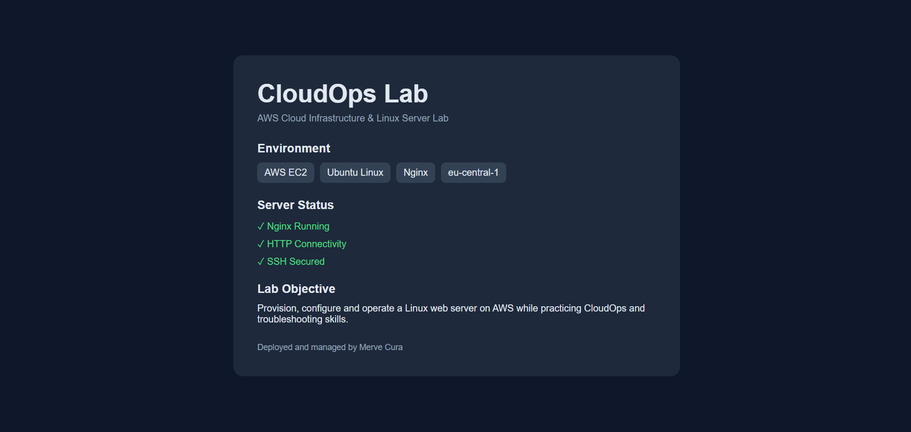

# ☁️ CloudOps Lab

A hands-on Cloud and DevOps engineering lab focused on building, operating, troubleshooting, and automating cloud infrastructure.

This repository documents my practical learning journey across AWS, Linux administration, networking, web servers, containers, CI/CD, Infrastructure as Code, Kubernetes, and monitoring.

---

## 🚀 Day 1 — AWS EC2, Linux & Nginx

### Objective

Provision and configure a Linux-based web server on AWS, establish secure remote access, perform basic Linux administration, troubleshoot network connectivity, and deploy a custom static website using Nginx.

---

## 🏗️ Architecture

```text
                    Internet
                       │
                       │ HTTP :80
                       ▼
               ┌─────────────────┐
               │ Security Group  │
               │                 │
               │ SSH  :22        │
               │ HTTP :80        │
               └────────┬────────┘
                        │
                        ▼
               ┌─────────────────┐
               │    AWS EC2      │
               │  Ubuntu Linux   │
               │                 │
               │     Nginx       │
               │       │         │
               │       ▼         │
               │ /var/www/html   │
               │   index.html    │
               └─────────────────┘
```

---

## 🛠️ Technologies Used

- AWS EC2
- AWS Security Groups
- Ubuntu Linux
- SSH
- Nginx
- HTTP
- Linux CLI
- GitHub Issues
- GitHub Projects

---

## ☁️ AWS EC2 Provisioning

A development EC2 instance was provisioned in the AWS Frankfurt region (`eu-central-1`) using Ubuntu Linux.

The instance was configured as a small development server for practicing Linux administration and CloudOps operations.

During provisioning, I worked with:

- EC2 instances
- AMIs
- Instance types
- EBS storage
- Public and private IPv4 addresses
- Security Groups
- SSH key-based authentication
- Instance start/stop lifecycle

---

## 🔐 SSH Access

Remote administration of the server was performed using SSH with public-key authentication.

Example:

```bash
ssh -i cloudops-dev-key.pem ubuntu@<PUBLIC_IP>
```

SSH access was restricted using the EC2 Security Group rather than unnecessarily exposing port `22` to the entire internet.

Because the instance does not currently use an Elastic IP, its public IPv4 address may change after a stop/start cycle.

---

## 🐧 Linux Server Administration

After connecting to the instance, basic system and resource checks were performed.

### User and system identity

```bash
whoami
hostname
pwd
```

### Network interfaces

```bash
ip addr
```

### Memory usage

```bash
free -h
```

### Filesystem usage

```bash
df -h
```

### Directory disk usage

```bash
sudo du -sh /var/*
```

### Running processes

```bash
ps aux
ps aux | grep ssh
```

These commands were used to inspect the operating system, network configuration, memory, storage, directories, and running processes.

---

## 🌐 Nginx Web Server

Nginx was installed as the HTTP web server.

```bash
sudo apt update
sudo apt install nginx
```

The service status was verified with:

```bash
systemctl status nginx
```

Running Nginx processes were inspected with:

```bash
ps aux | grep nginx
```

Port `80` was verified as listening with:

```bash
ss -tulpn | grep :80
```

The web server was then tested locally:

```bash
curl http://localhost
```

This confirmed that Nginx was running and responding to HTTP requests from inside the EC2 instance.

---

## 🔎 HTTP Connectivity Troubleshooting

During the lab, Nginx worked correctly through `localhost`, but the website was initially not reachable from an external browser.

The investigation included checking:

1. Nginx service status
2. Nginx processes
3. Listening ports
4. Local HTTP connectivity
5. AWS Security Group inbound rules

Since:

```bash
curl http://localhost
```

returned the Nginx page and port `80` was listening, the application itself was working correctly.

The issue was identified at the AWS network access layer: the Security Group initially allowed SSH traffic but did not allow inbound HTTP traffic.

An inbound HTTP rule for TCP port `80` was added.

After updating the Security Group, the Nginx server became reachable through the EC2 public IPv4 address.

### Root Cause

Missing inbound HTTP (`TCP/80`) rule in the EC2 Security Group.

### Resolution

Allow inbound HTTP traffic on port `80` through the required Security Group rule.

---

## 💻 Custom Website Deployment

Instead of keeping the default Nginx welcome page, a custom CloudOps Lab page was deployed.

The default Nginx web directory was inspected:

```bash
cd /var/www/html
ls -la
```

The original Nginx page was backed up before making changes:

```bash
sudo cp index.nginx-debian.html index.nginx-debian.html.backup
```

A custom page was then created:

```bash
sudo nano index.html
```

The deployed page contains information about the lab environment and verifies that the EC2 + Nginx deployment is operational.

The final deployment path is:

```text
/var/www/html/index.html
```

Local verification:

```bash
curl http://localhost
```

External verification was performed by accessing the EC2 public IPv4 address from a browser.

---

## 📸 Deployment Result

The custom CloudOps Lab page is successfully served by Nginx from the AWS EC2 instance.



---

## 📁 File Transfer with SCP

The deployed website source was transferred securely from the remote EC2 instance to the local Windows machine using SCP.

Example:

```bash
scp -i cloudops-dev-key.pem ubuntu@<PUBLIC_IP>:/var/www/html/index.html <LOCAL_PATH>
```

This allowed the deployed source code to be stored and versioned in this GitHub repository.

> Private key files such as `.pem` files must never be committed to the repository.

---

## 🧠 Key Learnings

This lab provided hands-on practice with:

- Provisioning an AWS EC2 instance
- Connecting securely to Linux servers using SSH
- Understanding public and private IP addresses
- Working with AWS Security Groups
- Inspecting Linux system resources
- Managing and inspecting Linux processes
- Installing and operating Nginx
- Understanding listening ports
- Testing HTTP services using `curl`
- Troubleshooting connectivity across application and network layers
- Understanding the Nginx web root
- Working with Linux file permissions
- Deploying custom static web content
- Transferring files between remote and local systems using SCP
- Documenting engineering work with GitHub Issues and Projects

---

## 🧩 Troubleshooting Approach

One of the main lessons from this lab was to troubleshoot connectivity layer by layer rather than changing configurations randomly.

```text
Browser
   ↓
Public IP
   ↓
AWS Security Group
   ↓
TCP Port 80
   ↓
Nginx
   ↓
/var/www/html/index.html
```

Testing each layer individually makes it easier to isolate the root cause of infrastructure problems.

---

## 📌 Project Progress

### Day 1 — Completed ✅

- [x] Provision AWS EC2 instance
- [x] Configure secure SSH access
- [x] Inspect Linux system resources
- [x] Inspect networking and processes
- [x] Install Nginx
- [x] Verify Nginx service
- [x] Verify listening HTTP port
- [x] Test HTTP locally with `curl`
- [x] Configure HTTP access through Security Group
- [x] Troubleshoot external connectivity
- [x] Deploy custom static website
- [x] Transfer deployed source using SCP
- [x] Document work using GitHub Issues and Projects

### Next

**Day 2 — AWS Networking & IAM**

---

## 🔭 Roadmap

Future labs will expand this project with:

- AWS VPC and networking
- IAM users, roles, and policies
- S3 and AWS service integration
- Docker
- Docker Compose
- CI/CD pipelines
- Terraform
- Kubernetes
- Monitoring and observability
- Prometheus and Grafana
- Infrastructure automation
- Cloud security practices

---

## 👩‍💻 Author

**Merve Cura**

Computer Engineer focused on Cloud & DevOps Engineering.
